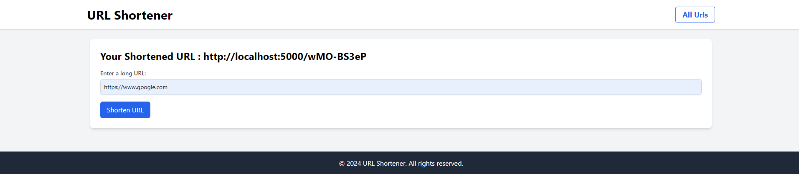
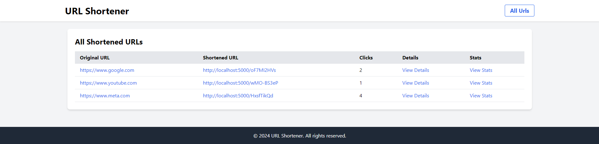
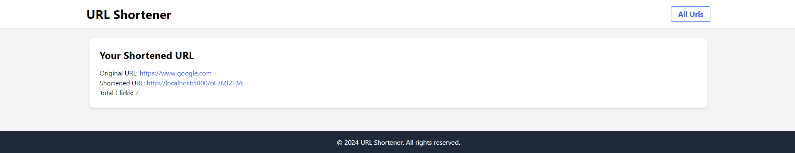
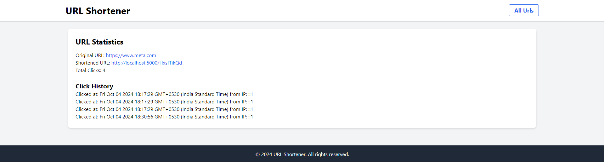

# URL Shortener Project

This project is a **URL Shortener** built using **EJS**, **Express**, **Node.js**, **MongoDB**, and **TailwindCSS**. It allows users to shorten long URLs and retrieve them via a shortened URL. The app also tracks how many times a shortened URL has been accessed.

## Features

- **Public Access**: No authentication required; anyone can use the app.
- **URL Shortening**: Users can input long URLs and receive a shortened version.
- **Click Tracking**: The app tracks the number of times a shortened URL has been clicked.
- **Rate Limiting**: Users can create only 5 shortened URLs per hour to prevent misuse.
- **List All URLs**: Users can view a list of all their shortened URLs along with the number of clicks.
- **URL Statistics**: View detailed statistics of each shortened URL, including total clicks and click history.

## Previews






## Technologies Used

- **Backend**:
  - Express.js
  - Node.js
  - MongoDB (Mongoose ODM)
- **Frontend**:
  - EJS (Embedded JavaScript templating)
  - TailwindCSS for UI
- **Rate Limiting**: Implemented using `express-rate-limit`.

## Folder Structure

```bash
.
├── /views
│   ├── /layouts
│   │   └── main.ejs  # Main layout file
│   ├── /partials
│   │   └── header.ejs  # Header partial
│   │   └── footer.ejs  # Footer partial
│   ├── /pages
│   │   └── home.ejs  # Home page for URL submission
│   │   └── urlDetail.ejs  # Displays details of shortened URL
│   │   └── stats.ejs  # Displays stats for a specific URL
│   │   └── error.ejs  # Error page for invalid URLs
│   │   └── allUrls.ejs  # Lists all shortened URLs
├── /public
│   ├── /css
│   └── /js
├── /routes
│   └── index.js  # Main routing file
│   └── shorten.js  # Routing for URL shortening and statistics
├── /models
│   └── Url.js  # Mongoose model for shortened URLs
│   └── Analytics.js  # Optional analytics tracking (if implemented)
├── .gitignore
├── app.js  # Main application file
├── package.json  # Node.js dependencies and scripts
└── README.md
```

## API Endpoints

- **POST /shorten**: Submit a long URL and receive a shortened URL.
- **GET /stats/:shortCode**: View the statistics for a shortened URL.
- **GET /urls**: View a list of all shortened URLs and their stats.
- **GET /:shortCode**: Redirect to the original URL using the shortened code.

## How to Run the Project

1. Clone the repository.

    ```bash
    git clone <repository-link>
    ```

2. Install dependencies.

    ```bash
    npm install
    ```

3. Create a `.env` file and add your MongoDB URI.

    ```bash
    MONGO_URI=mongodb://localhost:27017/url-shortener
    PORT=3000
    ```

4. Run the server.

    ```bash
    npm start
    ```

5. Open your browser and visit `http://localhost:3000` to access the app.

## Screenshots

- **Home Page**: Shorten your URL easily.
- **URL List**: View all your shortened URLs with click stats.
- **Statistics Page**: Check the details of each shortened URL's performance.

## License

This project is licensed under the MIT License.
